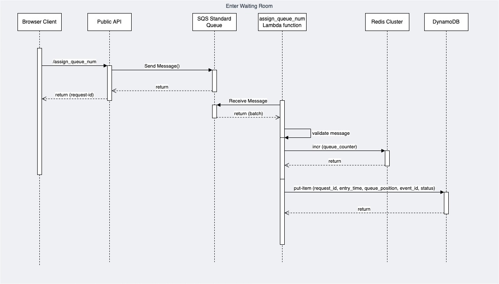
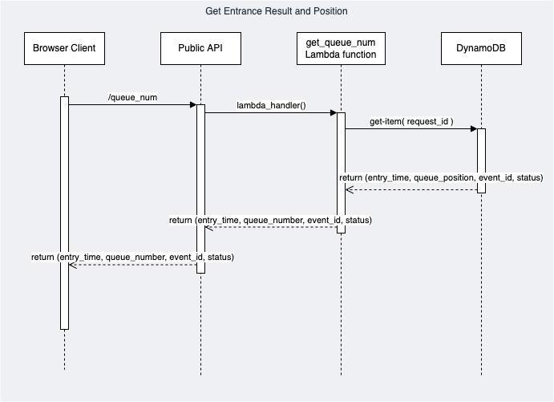
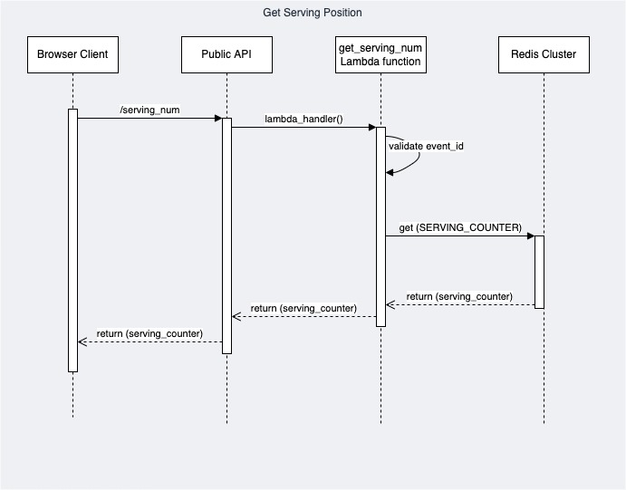
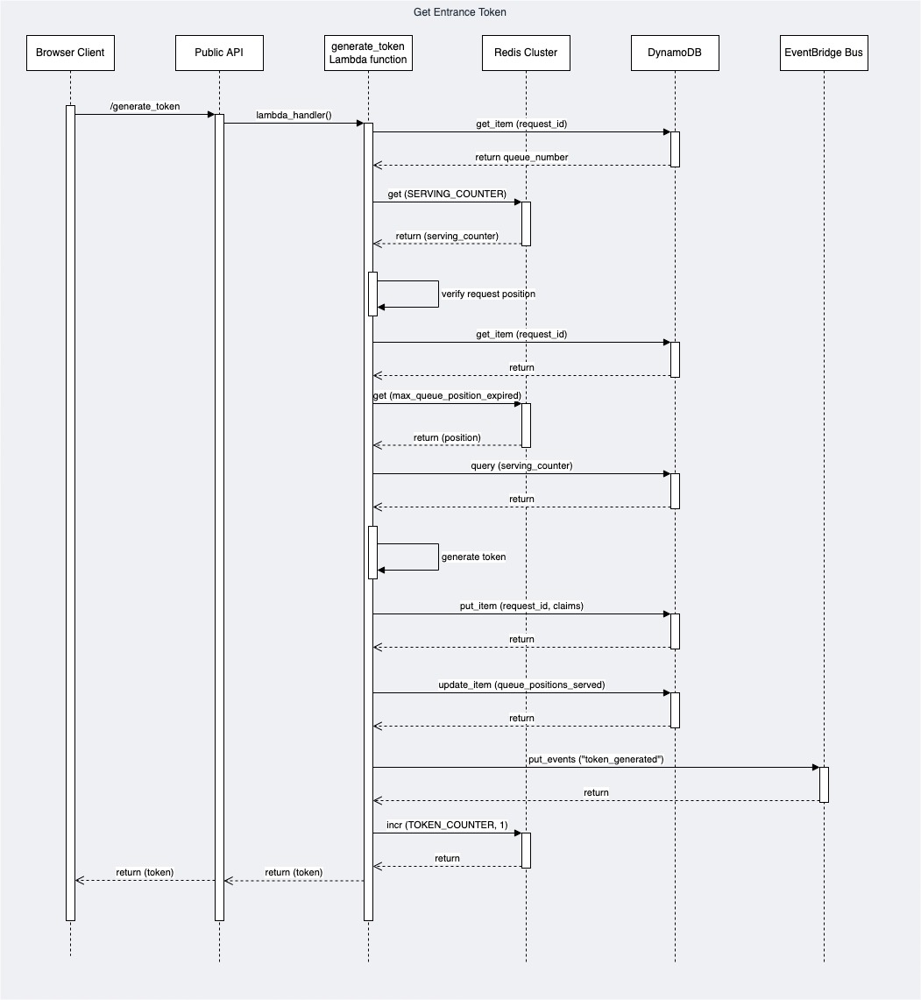

# Virtual Waiting Room on AWS Software Architecture Views

## Views

This document describes the architectural views for the Virtual Waiting Room on AWS (VWR) solution.

The views used in this document are:

1. use case view (functional requirements)
2. logical view (E-R, types)
3. deployment view (deployment artifacts to configured services)
4. physical view (deployed code and content, configured services, communication paths)
5. behavioral views (sequence diagrams)

### Use Case View

**Actor: Cloud Administrator**

*Use Case: Create Tool Stack*

1. The actor locates the required URLs for the MSAM CloudFormation templates
2. The actor decides which region in which to install the new stack
3. The actor launches the all-resources template to create a new MSAM stack in the chosen region

Postconditions: The stack is created

*Use Case: Update Tool Stack*

1. The actor locates the required URLs for the MSAM CloudFormation templates
2. The actor locates the existing stack in CloudFormation
3. The actor uses the all-resources template to update the MSAM stack in the chosen region

Postconditions: The stack is updated

*Use Case: Delete Tool Stack*

2. The actor locates the existing stack in CloudFormation
3. The actor chooses to delete the stack from the region

Postconditions: The stack is deleted

**Actor: Event Site Administrator**

*Use Case: Configure Event Site Integration*

Preconditions: The use case starts when the actor need to configure the integration between the event site and the waiting room site

1. The actor decides on the integration methods to use:
   1. Basic integration directly using APIs and API Gateway authorizers
   2. Open ID integration through a identity provider
2. The actor configures the domain name redirection, if required
2. The actor deploys the customized waiting room site pages

Postconditions: The event site and waiting room site are integrated via the mechanism chosen by the actor

*Use Case: Configure Inlet Strategy*

Preconditions: The use case starts when a 

1. CloudWatch invokes the Waiting Room Lambda function subscribed to this event pattern
2. The function collects the counter values from Redis
3. The function queries DynamoDB for token session states
4. The function creates a JSON data structure with the various metrics collected above
5. The function publishes an event to the Virtual Waiting Room event bus

Postconditions: The JSON-formatted metrics are published to the subscribers

**Actor: CloudWatch Scheduler**

*Use Case: Broadcast Waiting Room Metrics*

Preconditions: The use case starts when a CloudWatch scheduled rule is triggered to launch the Generate Events Lambda function

1. CloudWatch invokes the Waiting Room Lambda function subscribed to this event pattern
2. The function collects the counter values from Redis
3. The function queries DynamoDB for token session states
4. The function creates a JSON data structure with the various metrics collected above
5. The function publishes an event to the Virtual Waiting Room event bus

Postconditions: The JSON-formatted metrics are published to event bus subscribers

**Actor: Site User**

*Use Case: Visit Site*

1. The actor opens their browser and navigates to the web site
2. The web site code determines the current capacity of the site 
2. If the site is currently over capacity, the user is redirected to the waiting room site

Postconditions: Branch to use case *Enter Waiting Room*

*Use Case: Enter Waiting Room*

Preconditions: The actor's browser navigates to the waiting room page

1. The actor chooses to enter the line
2. The page retrieves the position in line
2. The page retrieves the current serving position of the queue
   3. The page periodically updates the serving position
   3. If the serving position is greater than the actor's position in line, the actor can progress through the waiting room and enter the web site
   3. The use case ends
4. The actor chooses may choose to abandon their position in the waiting room and leave the page

*Use Case: Progress Through Waiting Room*

Preconditions: The actor's browser is granted access to the web site

1. The actor's browser navigates from the waiting room to the web site
2. The web site verifies the permissions granted to the actor's browser
2. The actor uses the web site for their transaction

**Actor: API Client**

*Use Case: Public API Request*

Preconditions: The actor has the public endpoint URL

1. The actor builds the API resource by adding a known path to the URL and constructs any needed data
2. The actor sends a request to the API resource
3. The actor receives a response from the resource.

Extension: Public API Request w/Notification

1. The actor builds the API resource by adding a known path to the URL and constructs any needed data
2. The actor sends a request to the API resource
3. If the back-end state has changed, the API handler sends a notification to the event bus for this installation.
3. The actor receives a response from the resource.

*Use Case: Private API Request*

Preconditions: The actor has the private endpoint URL

1. The actor builds the API resource by adding a known path to the URL and constructs any needed data
2. The actor sends a request to the API resource
3. The actor receives a response from the resource.

Extension: Private API Request w/Notification

1. The actor builds the API resource by adding a known path to the URL and constructs any needed data
2. The actor sends a request to the API resource
3. If the back-end state has changed, the API handler sends a notification to the event bus for this installation.
3. The actor receives a response from the resource.

### Logical View

The elements in this view represent the types (and terminology) of the problem space.

#### Web Site

This type represents the web site being protected or wrapper by the Virtual Waiting Room.
#### Capacity

This type represents the capacity numbers for the protected web site. The capacity is the total number of concurrent users that can be using the site.
#### Counter

This type represents the numeric position of the end of the queue, or the total number of people that are in and have mved through the Virtual Waiting Room.

#### Event

This type represents a one-time event for a web site that requires protection from excessive concurrent users. The event associates the web site, the waiting room queue, the cryptographic keys and numeric counters that are used to progress users through the waiting room.
#### Waiting Room Queue

This type represents the virtual queue of users waiting for entry to the web site. The waiting room queue is an ordered set of requests, each with a unique queue position within the queue. The request's queue position and the queue's serving position are used to determine when a new user can enter the web site.

#### Serving Position

This type represents the highest queue position that can receive access to the web site. All requests with a queue position equal to or lower than this value can enter the web site.

#### Public Key

This type represents the public JSON Web Key that is generated for this installation of the Virtual Waiting Room. The public key is used to verify signatures of JSON Web Tokens issued from the Virtual Waiting Room.

#### Private Key

This type represents the private JSON Web Key that is generated for this installation of the Virtual Waiting Room. The private key is used to sign JSON Web Tokens issues from the Virtual Waiting Room.
#### Request

This type represents the request made by the customer to enter the queue for the Virtual Waiting Room. The request is tracked throughout the customer's visit to the waiting room and web site. The request is related to a queue position, which may be before or after the serving position. The request is also related to an access token in the form of a JWT.
#### Access Token

This type represents a JSON Web Token issued by the waiting room to gain access to the web site or interact with protected APIs of the site.
#### Queue Position

This type represents a numeric position of a request within the Virtual Waiting Room queue. A queue position less than serving position can gain access to the web site. A queue position greater than the serving position will wait for a token until serving position advanced forward up to or past the queue position.

#### Session State

This type represents the state of a request. This is supplemental state used to track JSON Web Tokens after being issued. A token can remain valid after the user has completed their visit to the web site. This state is used to track if a token has been used and the user has departed the site.

### Deployment View

The deployment view shows the relationships between the deployment units (installers, binaries, CloudFormation templates) and the target services that receive the deployment configuration or run deployed code. 

There are six CloudFormation templates available for the Virtual Waiting Room on AWS. Two templates are intended for deployment together into one account's region. The remainining four templates can be deployed into the same or different regions, or separate accounts from the two primary templates. Each template is briefly described below.

#### virtual-waiting-room-on-aws-api-gateway-cw-logs-role.template

This template is used to create and configure an IAM Role for API GAteway that allows it to send access logs to CloudWatch. The Role is configured at the account/region level, so it may or may not exist when the Virtual Waiting Room on AWS is installed the first time. Run this template if no existing IAM Role for API Gateway logging has been added for the region.

#### virtual-waiting-room-on-aws.template

This is the primary template for the Virtual Waiting Room on AWS. This template configured all the foundational APIs, events, Virtual Private Cloud, Elasticache and DynamoDB table. This template is always installed with a new event.

#### virtual-waiting-room-on-aws-authorizers.template

This template installs the API Gateway authorizers that can be used by the customer with Virtual Waiting Room on AWS issued JSON Web Tokens. After installing this template, the customer can add the authorizers to one or more API Gateway REST APIs to only allow users access who have passed through the waiting room.
#### virtual-waiting-room-on-aws-openid.template

This is an optional template that provides a set of APIs for Open ID Connect authorization and a sample page that acts as a waiting room within the authentication flow. This template is a logical layer above the primary public and private APIs configured by virtual-waiting-room-on-aws.template.

#### virtual-waiting-room-on-aws-sample-inlet-strategy.template

This template installs two sample inlet strategies in the form of Lambda functions, CloudWatch rule, SNS topic, and gives the user the choice of activating one. The customer can use these as starting points for customizing a strategy based on their web site's infrastructure.
#### virtual-waiting-room-on-aws-sample.template

This template installs a complete sample waiting room and protected API that uses the custom authorizers.

### Physical View

The physical view shows the deployed software with configured cloud resources and control and data connections among them.

The previous diagram shows the significant subsystems installed for the Virtual Waiting Room on AWS.

The stack resources for virtual-waiting-room-on-aws.template are shown at the right of the diagram. This stack installs a public API and private (IAM-authorized) API used for most operations of te Virtual Waiting Room on AWS. The public API is configured with a CloudFront distribution with multiple caching policies based on the API called. A DynamoDB table and EventBridge event bus is also created here. This stack installs a VPC with two availability zones, a Redis cluster in those AZs, and several Lambda functions. Lambda functions that interact with Redis are installed within the VPC and all other are installed in the shared AWS network space.

The stack resources for virtual-waiting-room-on-aws-authorizers.template are shown at the top-left of the diagram. This stack installs one IAM role and Lambda function. The Lambda function is a custom authorizer for API Gateway and may be used by the customer to protect APIs until a user has progressed through the waiting room and receives an access token.

The stack resources for virtual-waiting-room-on-aws-sample-inlet-strategy.template are shown at the bottom-center of the diagram. These are two sample Lambda functions that are installed with either a CloudWatch schedule rule or an SNS topic used to signal the Lambda. The concept behind the inlet strategy is to determine when the serving counter of the Virtual Waiting Room on AWS should move forward to accomodate more users in the web site.

The stack resources for virtual-waiting-room-on-aws-openid.template are shown at the middle-left of the diagram. This stack acts as an adapter to the public and private APIs and provides a set of APIs that are compatible with Open ID Connect. This stack allows a customer to use the waiting room in the AuthN/AuthZ flow when using off-the-shelf web hosting software with limited integration options.

Finally, the stack resources for virtual-waiting-room-on-aws-sample.template are shown in this diagram at the far left showing CloudFront distributions in front of S3 bucket origins, and at the top with the custom authorizer. The sample stack integrates with the other stacks to demonstrate a minimal end-to-end waiting room solution.

### Behavioral Views

The following sequence diagram shows the first steps by a user to enter the Virtual Waiting Room and obtain a position in the line.

The following sequence diagram shows the steps to query the user's position using the request ID received from the Enter Waiting Room sequence.

The following sequence diagram shows the steps, that are often repeated at an interval, to receive the current serving position of the Virtual Waiting Room line.

The following sequence diagram shows the steps to obtain a JSON Web Token from the public API after the serving position has moved past the user's position in the queue.

The following sequence diagram shows the steps that are used with the Virtual Waiting Room API Gateway authorizers.

